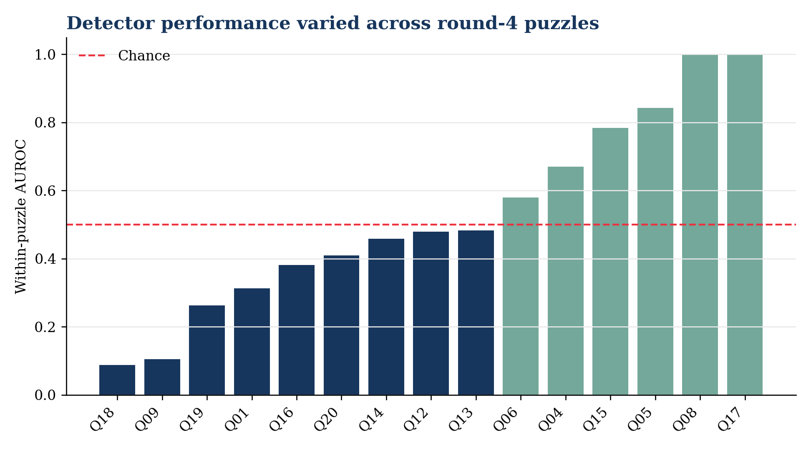
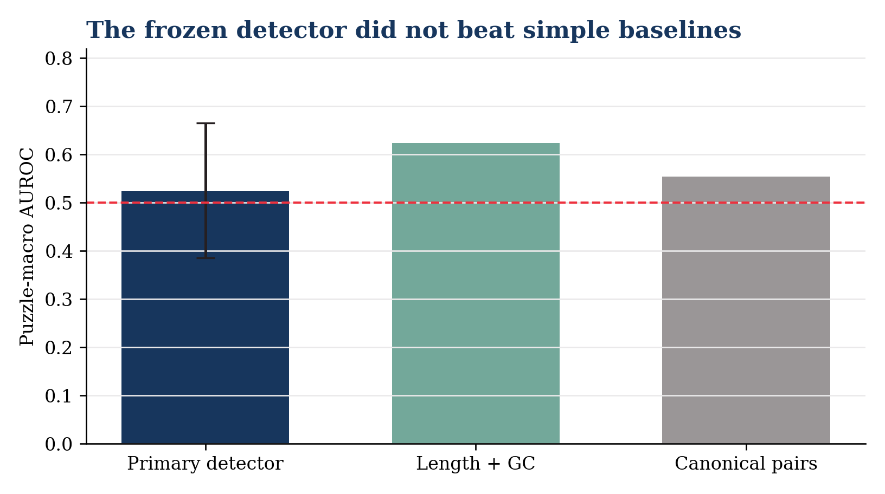

\noindent\colorbox{softblue}{\parbox{0.96\linewidth}{\textbf{Adjudicated claim.} A frozen pre-assay sequence/topology detector did not discriminate OpenKnot scores below the external 80 benchmark among submitted, assayed gRNAde designs in round 4. This is not evidence that gRNAde molecules failed to form, and it is not a universal test of RNA-model hallucination.}}

## Abstract

Generative RNA models need audit methods that can distinguish plausible-looking sequences from designs that do not meet experimental benchmarks. We prospectively tested a frozen detector on a named open model, gRNAde, using Eterna OpenKnot 2A3-MaP chemical-mapping data. The endpoint was an OpenKnot score below 80, an external threshold defined before outcome access. Model development used rounds 1-3; round 4 was a no-touch temporal test. Prediction units grouped identical puzzle, normalized sequence, and target-structure submissions before outcomes. The detector used 120 deterministic sequence, target-topology, and sequence-target compatibility features in L2 logistic regression. On 357 round-4 units, 15 puzzles contained both endpoint classes. Puzzle-macro AUROC was 0.524 (95% puzzle-bootstrap CI 0.385-0.666), below both the length+GC baseline (0.624) and the canonical-pair baseline (0.555). All five locked success gates failed. The result is a useful negative: the frozen feature set does not support the proposed audit role under later-round, puzzle-grouped experimental validation.

## Introduction

RNA inverse-design systems can generate sequences that score well computationally while their experimental chemical-mapping profiles fall short of an intended structural target. Calling this a "hallucination" is tempting but imprecise. A defensible audit needs a named generator, a real experimental endpoint, a predeclared prediction unit, separation between development and test targets, and success gates fixed before outcomes are read.

DOC-2-019 R0 tested short-range sequence features against first-order Markov surrogates and failed its locked discrimination gate. R1.1 raised the standard: a named open model, an experimental benchmark, a later-round temporal test, puzzle-clustered evaluation, and an outcome firewall. We asked whether information available before assay could identify gRNAde submissions with an OpenKnot score below the external benchmark of 80.

OpenKnot documentation defines the score as 0-100, with higher values more likely to represent pseudoknots, and states that a score above 80 has a good chance of representing a pseudoknot. It also warns that molecules below 80 may still form pseudoknots because SHAPE cannot distinguish them. We therefore use "experimental score failure," never molecular non-formation.

## Methods

### Model and benchmark

The named model was gRNAde v1.0.0, an open geometric RNA inverse-design model. Code was pinned to commit `2453b18778a1981ac25f314790e5395f1e9ab218`; the checkpoint repository was pinned to revision `91491fc71584bf37fee8297781edf7df07b1d349`. The benchmark was Eterna OpenKnot commit `211a90e2b0dcc47d1a0325a6737e3b48bf76da52`, file SHA-256 `22fa72df...77901`. Its assay was 2A3-MaP chemical mapping.

We included rows with exact method `gRNAde`, assay type `2A3_MaP`, benchmark quality flag `SN_filter=1`, a valid round and puzzle, and strictly parsed sequence and target structure. `gRNAde-no3d` was not pooled with the primary cohort.

### Endpoint and prediction unit

Failure was `target_openknot_score < 80`; success was score at least 80. Orientation came from commit-pinned official documentation, not from outcome distributions. Before outcomes, records were grouped by `(puzzle, normalized design sequence, normalized target structure)`. Assay replicates remained attached to the unit, and their frozen endpoint was the median score. Same sequence with a different target remained a separate unit. Round-4 sequences matching development sequences, or appearing under multiple test puzzles, were excluded by outcome-blind rules.

### Features and model

The feature map contained 120 fixed values in a sealed order:

- nucleotide composition, entropy, homopolymers, and all di- and trinucleotide frequencies;
- paired fraction, pseudoknot-bracket fraction, crossing pairs, spans, stems, and unpaired runs;
- target-pair compatibility for AU, GC, GU and noncanonical pairs, including crossing-pair compatibility;
- paired-versus-unpaired composition and explicit missingness flags.

The primary detector was L2 logistic regression. Candidate C values were 0.01, 0.1, 1, 10 and 100. Five folds were assigned by sorted puzzle name modulo five before labels. Hyperparameters maximized mean puzzle-macro AUROC; ties chose smaller C. Baseline A used length and GC only. Baseline B used one minus canonical target-pair fraction.

### Outcome firewall and test

Rounds 1-3 formed development; round 4 was the no-touch test. Input hashes, parser tests, schema controls, feature-map hash and fold-map hash were sealed before labels. Development labels were then loaded; each training and validation fold had to contain both endpoint classes. Chosen C, decision threshold, development length cut, and controls were sealed before round-4 outcomes loaded.

The primary estimand was unweighted mean within-puzzle AUROC across round-4 puzzles containing both classes. The 95% interval used 10,000 puzzle-cluster bootstrap draws. Baseline differences used the same bootstrap draws. The short/long threshold was the development-unit median length, 88 nt.

### Locked gates

A positive R1.1 required all of:

1. puzzle-macro AUROC at least 0.75;
2. bootstrap lower bound at least 0.65;
3. point improvement at least 0.05 over the better frozen baseline;
4. AUROC at least 0.70 in both development-cut length strata;
5. more than half discrimination in at least 70% of evaluable puzzles.

## Results

### Cohort and controls

Metadata gates passed before labels: 970 development units, 357 unexcluded test units, 31 development puzzles, 20 test puzzles, and 100% parser yield. Development contained 365 score-failure and 605 success units. The selected primary C was 100; its development puzzle-macro AUROC was 0.653. The length+GC baseline selected C=0.1 and reached 0.674. One hundred within-puzzle label shuffles averaged 0.496, consistent with the expected null. Parser, schema, inversion, fold-class, hash and convergence controls passed.

### Locked test

Fifteen round-4 puzzles contained both classes. The primary puzzle-macro AUROC was **0.5238** (95% CI **0.3853-0.6657**). Baseline A reached **0.6236**, a primary-minus-baseline difference of **-0.0997** (paired 95% CI -0.2188 to 0.0120). Baseline B reached **0.5547**, difference **-0.0308** (paired 95% CI -0.2324 to 0.1575).

**Locked gate readout**

- **Primary AUROC:** 0.5238 vs >=0.75 - **fail**.
- **Bootstrap lower bound:** 0.3853 vs >=0.65 - **fail**.
- **Improvement over better baseline:** -0.0997 vs >=0.05 - **fail**.
- **Length robustness:** long 0.5238; short not evaluable vs both >=0.70 - **fail**.
- **Puzzle direction:** 40% vs >=70% with AUROC >0.50 - **fail**.

All five gates failed. Puzzle performance varied widely, from 0.088 to 1.000, but that heterogeneity did not rescue the locked aggregate. The short stratum had no puzzle with both classes and failed closed rather than being replaced with a pooled measure.

{width=95%}

{width=82%}

## Discussion

This prospective test did what a strong audit should do: it made failure informative. A detector with richer biological-looking features did not generalize to a later experimental round and performed worse than a simple length+GC baseline. The result argues against presenting this frozen detector as a useful pre-assay hallucination screen.

Several interpretations are plausible but not distinguishable here. Sequence and target-topology summaries may be too coarse for experimental structural agreement. Selection of submissions before synthesis can compress the feature range. OpenKnot puzzles differ materially, as the broad puzzle-level AUROCs show. The endpoint itself is an experimental score benchmark rather than direct proof of a single molecular fold.

The negative result does not show that gRNAde fails as an RNA-design system. It does not establish that below-80 molecules lack pseudoknots. It does not rule out detectors using raw model logits, full 3D target geometry, ensemble folding uncertainty, or predictors trained across multiple named generators. Those are new studies and require new locks.

### Next study

A grant-defensible successor should change the information set rather than tune this result. One option is a prospective cross-model benchmark using raw generation-time uncertainty, 3D geometric descriptors and independent folding ensembles, with model-held-out and puzzle-held-out axes. A second is a mechanistic study of why length+GC generalized better, specified before any new outcomes. Neither belongs inside R1.1.

## Reproducibility and integrity

The approved protocol SHA-256 was `ccd70bb8...fe97b6`; the exact feature schema SHA-256 was `04bee8d4...e63d5`. The sealed archive SHA-256 was `4521bfcb...94a33`, with a 31-file internal manifest verified without mismatches. It was read back byte-identically from Google Drive and from repository commit `67d7effc8c4915a27c3f69b5cb00a33d8c0eeb09`.

Three same-spec code repairs followed initial test access: fail-closed handling of an unevaluable length stratum, NumPy boolean serialization under strict JSON, and console-only rendering. They changed no feature, cohort, label, prediction, metric, threshold, model or gate. Raw unit and assay-replicate prediction rows, development folds, 10,000 bootstrap draws, environment manifest, runtime ledger and repair notes are preserved in the sealed package.

## Data and code availability

- gRNAde code: <https://github.com/chaitjo/geometric-rna-design>
- gRNAde model files: <https://huggingface.co/chaitjo/gRNAde>
- OpenKnot data: <https://github.com/eternagame/OpenKnotAIDesignData>
- OpenKnot score definition: <https://github.com/eternagame/OpenKnotScoreMATLAB>

## Conclusion

The frozen pre-assay sequence/topology detector did not discriminate OpenKnot scores below 80 among submitted, assayed gRNAde designs in round 4. The negative result is preserved as the outcome, not tuned away.
