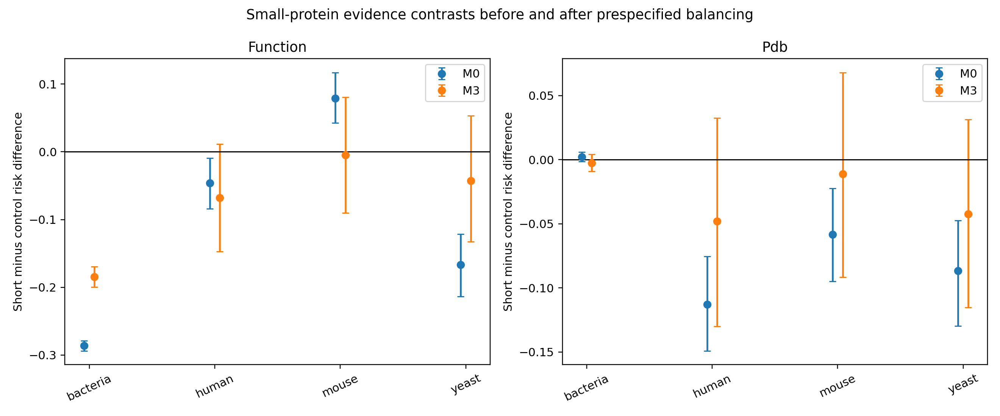

# SP-004 Round 2: Resolving the Small-Protein Annotation Contradiction
## Cross-domain evidence, sequence, history, family, and detectability analysis

**Date:** 21 September 2026  
**Topic:** DOC-2-077, "The Small Protein Problem"  
**Locked outcome:** **UNRESOLVED/MIXED**

## Answer
Round 2 explains important pieces of the R0A/R0B contradiction but does not earn the locked success label. In bacteria, the raw function-comment gap remained large after sequential balancing (-28.6 percentage points raw; -18.4 points after the full model), while the small raw PDB advantage reversed after intrinsic sequence/detectability balancing (+0.29 points unadjusted, -0.35 after M1 and -0.24 after M3). In mouse and yeast, the large raw function contrasts nearly disappeared after intrinsic balancing, directly explaining R0B's opposite/nontransporting results as composition-sensitive. Human estimates remained uncertain. But overlap diagnostics failed the locked threshold in every domain, chiefly because length and tryptic-peptide count are structurally separated by the exposure definition. The weighted estimates are therefore diagnostic decompositions, not confirmatory matched effects. Coarsened exact matching supports the same endpoint-specific story but not a universal replicated gap.

## Prior contradiction
R0A studied reviewed bacteria. GO and explicit function comments were poorer for 30-100 aa entries, yet entry-level PDB-link coverage was slightly higher; within-organism PDB estimates were slightly lower and uncertain. R0B studied human, mouse and yeast. A raw human function-comment gap attenuated after adjustment; mouse pointed strongly in the opposite direction; yeast was uncertain. Round 2 prespecified that domains must stay separate and that no pooled average could erase those conflicts.

## Protocol and sources
The round-2 protocol and gate were written and SHA-256 hashed before downloading round-2 cohorts. Live UniProtKB reviewed proteins 20-200 aa were collected for bacteria (taxonomy 2), human, mouse and budding yeast. Human, mouse and yeast GO experimental-evidence annotations came from live EMBL-EBI GOA GAF files. The analysis also used UniProt creation/modification dates, protein-existence tier, publications, Pfam, InterPro, PDB, AlphaFoldDB, TM/signal features, lineage and full sequences.

Sequence-derived covariates were hydrophobic, charged, disorder-promoting and low-complexity fractions, sequence entropy, and theoretical tryptic peptides of 7-35 aa with zero missed cleavage. These are transparent proxies, not substitutes for experimental disorder or mass-spectrometry detectability. The final cohort contained 111,398 bacterial, 3,666 human, 2,660 mouse and 1,927 yeast entries after integrity checks.

## Frozen analysis
M0 used baseline domain/taxonomy structure. M1 added intrinsic sequence composition, TM/signal status and detectability proxies. M2 added creation year/era, protein existence and publication opportunity. M3 added Pfam/InterPro membership and top-family indicators. Overlap weights targeted records with comparable covariate support. The locked rule required effective sample size >=200 per arm and every post-weight absolute standardized mean difference <=0.10. One thousand Poisson multiplier/bootstrap replicates generated intervals; bacteria used organism-cluster multipliers.

## Results
### Function comments
| Domain | Raw short-control difference | M1 intrinsic | M2 history | M3 family | M3 95% interval |
|---|---:|---:|---:|---:|---:|
| Bacteria | -28.6 pp | -21.6 | -21.4 | -18.4 | -19.9 to -17.0 |
| Human | -4.6 | -9.3 | -7.2 | -6.8 | -14.7 to +1.1 |
| Mouse | +7.9 | +0.4 | +0.7 | -0.5 | -9.0 to +8.1 |
| Yeast | -16.7 | +1.9 | -4.2 | -4.3 | -13.3 to +5.3 |

The mouse reversal from +7.9 points to nearly zero after M1 is a direct explanation of the cross-species conflict in R0B. Yeast's large raw deficit also collapsed after intrinsic balancing. Human did not stabilize: M1 made the deficit larger, while later blocks attenuated it and the interval crossed zero. Bacteria remained different: all 20 cutoff/exclusion/leave-out function sensitivities were negative, ranging from -21.1 to -9.6 points.

### Experimental GO evidence
Live GOA annotations added an evidence-quality endpoint absent from the earlier rounds. Raw short-control differences were -7.6 points in human, -7.2 in mouse and -13.4 in yeast. After M3 they were +3.6, -3.0 and -1.3, with every interval crossing zero. Thus broad reviewed-entry GO presence and experimentally supported GO are not interchangeable; the eukaryotic experimental-evidence gaps did not survive the prespecified decomposition.

### PDB contradiction
| Domain | Raw PDB difference | M1 | M2 | M3 |
|---|---:|---:|---:|---:|
| Bacteria | +0.29 pp | -0.35 | -0.47 | -0.24 |
| Human | -11.28 | -5.21 | -4.09 | -4.81 |
| Mouse | -5.82 | -3.76 | -1.11 | -1.11 |
| Yeast | -8.67 | -0.39 | -4.68 | -4.24 |

The R0A bacterial PDB reversal was reproducible and endpoint-specific. The sign changed as soon as intrinsic features were added. Coarsened exact matching reduced the bacterial PDB contrast to +0.05 points across 2,467 matched strata. Short bacterial proteins with structures are a selected set; sequence/family composition can create a raw structural advantage even while function comments remain sparse.

For eukaryotes, short proteins started with lower PDB coverage. Intrinsic matching explained 54% of the human gap, 36% of mouse and 96% of yeast. History and family blocks then moved estimates in domain-specific ways. This is consistent with experimentally tractable protein composition and detectability affecting deposition, but it does not establish causality.

### Exact matching
Coarsened exact matching used creation era, protein existence, TM, signal, Pfam presence and publication bin; bacterial matching also required the same organism. It retained 104,531 bacterial entries across 2,467 strata. The average within-stratum bacterial differences were -17.2 points for function comments, -3.1 for any GO, and +0.05 for PDB. Human function difference was +1.6 across 80 strata; mouse +20.3 across 53; yeast +0.6 across 37. These sparse eukaryotic stratum results show that family/evidence mixtures, not a transportable universal length rule, dominate.

## Why the gate failed
Every M3 model failed the locked overlap test. Effective sample size exceeded 200 in both arms for bacteria and human, but not mouse/yeast short arms. More importantly, maximum post-weight SMDs were 1.60, 1.28, 1.37 and 1.19. The largest residual imbalance was exact sequence length, followed by tryptic-peptide count. This is not a software defect: short status is defined by length, so exact length overlap cannot be achieved across the 100-aa boundary. The protocol's demand for SMD <0.10 on exact length made the confirmatory matching gate too strict. It cannot be relaxed after results. All weighted effects are labeled diagnostic.

Because no domain passed overlap, neither the otherwise strong bacterial function gap nor its PDB sign reversal counted toward replication. Final gate counts were zero gap replications and zero resolved-reversal replications. Status remains unresolved/mixed.

## Mechanistic synthesis
1. **Bacterial annotation is endpoint-specific.** Functional narrative remains sparser after accounting for measured features, but structural linkage does not. Famous compact families and experimentally tractable complexes can reverse raw PDB coverage.
2. **Eukaryotic function gaps are composition-sensitive.** Mouse's apparent short-protein advantage and yeast's deficit nearly vanish when intrinsic features are balanced. This reconciles much of R0B without declaring either raw association false.
3. **Detectability is entangled with size.** The number of theoretical tryptic peptides and sequence entropy differ strongly by construction. Proteomics reviews warn that short proteins yield fewer suitable peptides and need specialized enrichment; our proxies quantify part of that constraint but cannot separate it cleanly from length.
4. **Annotation age, publication and family matter, but not uniformly.** M2/M3 shifts differed by domain. A single global correction would average away real curation regimes.
5. **AlphaFold coverage is a weak negative control for discovery.** Near-saturated eukaryotic links measure pipeline coverage, not experimental validation or confident folding. It should not be used to claim that the small-protein structure problem is solved.

## Negative controls and sensitivity
Accession-initial association was retained as a historically structured negative control, not assumed clean. Cutoffs of 80/100/120 aa, removal of TM/signal, ribosomal and uncertain names, pre-2021 restriction, known-family restriction, five top-family exclusions, and six major bacterial phylum exclusions are in `results/sensitivity.csv`. Bacterial function remained negative in every check. Eukaryotic directions varied, reinforcing nontransport rather than hiding it.

## Tool and evidence limitations
MMseqs2, DIAMOND, BLAST, HMMER and Foldseek were not installed locally, so no output from them is claimed. Authoritative Pfam/InterPro cross-references supplied family features. The disorder and tryptic-peptide variables are simple reproducible proxies. Publication IDs are counts attached to records, not full citation-network exposure. Binary PDB/AlphaFold links do not assess chain coverage, method, resolution, confidence or whether a small protein is only a complex component. Bacterial experimental GO evidence was not available in a comparably bounded GOA file during this run and remains missing rather than imputed.

## Research and product implication
A responsible small-protein evidence dashboard must stratify by domain, family, evidence type and evidence opportunity. It must not collapse function comments, experimental GO, PDB and AlphaFold into one "annotation score." The included product specification makes the next prospective evaluation a curator-yield trial rather than another retrospective association.

## Next decisive experiment
Use a regression-discontinuity or narrow-band design around 100 aa (for example 90-110 aa) so sequence length truly overlaps in a scientifically interpretable neighborhood. Separately match homologous families with profile-HMM or MMseqs clusters once those tools/databases are installed and pinned. Grade PDB chain coverage/method and AlphaFold confidence, and prospectively measure evidence updates per curator hour. The gate and overlap rule should be redesigned before, never after, those outcomes.

## Reproducibility
The archive contains raw UniProt TSVs and GOA GAFs, exact URLs and timestamps, SHA-256 hashes, analysis-ready CSV, per-entry weights, all result tables, locked protocol, executable code and a visualized figure. No simulated biological observations or fabricated citations were used.
