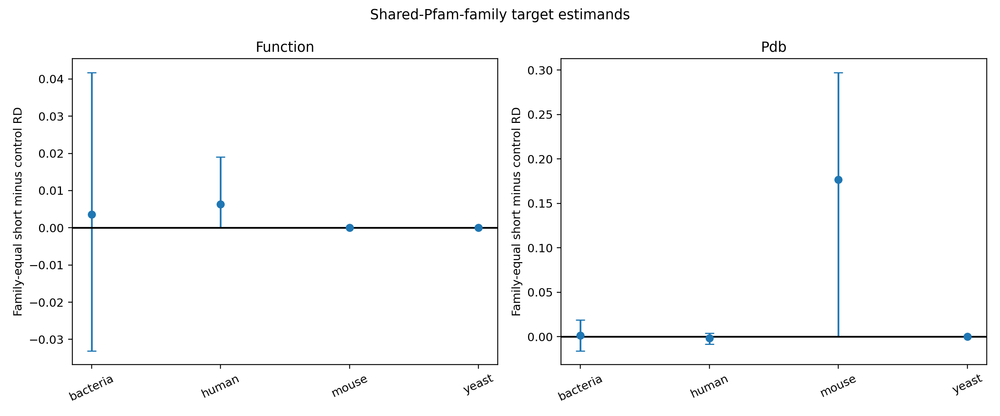

# SP-004 Round 3: Common-Family Target Estimands
## Does the small-protein evidence gap persist inside shared Pfam families?

**Date:** 21 September 2026  
**Status:** **MIXED/NONTRANSPORTING - LOCKED GATE FAILED**

## Result
Changing the estimand changed the scientific answer. Among 82 estimable bacterial Pfam families containing at least five short and five control proteins, the family-equal function-comment difference was +0.36 percentage points (95% family-bootstrap CI -3.31 to +4.18), not the -28.6 point whole-cohort deficit seen in R2. The family-equal PDB difference was +0.13 points (CI -1.58 to +1.90). In the 80-120 aa narrow band, the corresponding differences were +2.10 and +0.01 points. Thus the bacterial whole-cohort function gap is predominantly a between-family/compositional phenomenon in the target population measurable here.

The cross-domain replication gate nevertheless failed. Human had only five eligible shared families (51 short, 53 controls), mouse three (29, 33), and yeast two (14, 14). The protocol required at least ten families and 200 proteins per arm. These domains are non-estimable, not negative replications.

## Why R3 was needed
R2's propensity design could not balance exact length and tryptic-peptide opportunity across a threshold defined by length. Weakening that gate after seeing results would have been invalid. R3 instead asks a narrower question: within protein families that naturally span the threshold, do short members carry less database evidence? This estimates the shared-Pfam-family population, not all proteins and not a causal effect of deleting residues.

## Frozen design
The R3 protocol was hashed before shared-family outcomes. It reused the checksum-frozen live UniProt/GOA R2 cohort. Each entry used the deterministic first Pfam ID recorded in R2. Eligible primary families required >=5 entries per arm; narrow-band families required >=3 per arm in 80-120 aa. Families were the inferential clusters and received equal weight. A harmonic-arm-size analysis supplied a protein-targeted secondary estimand. Two thousand family-bootstrap replicates generated intervals.

## Bacterial findings
Eighty-two families included 12,842 short and 8,068 control proteins. The function estimate was essentially null under both family-equal (+0.36 pp) and protein-targeted (+0.20 pp) weighting. PDB was also null-like (+0.13 pp family-equal; +0.91 protein-targeted). AlphaFold linkage, a negative control, was -0.44 points with its interval close to zero.

The narrow-band analysis contained 87 families and again showed no function deficit (+2.10 pp). Minimum-family-size and leave-top-family-out tables are retained. The result does not prove that length is irrelevant. It shows that the giant raw bacterial function gap is not present among Pfam families with members on both sides of 100 aa. Between-family membership, family detectability, and which families become reviewed dominate the broad comparison.

## Eukaryotic non-estimability
Human's five-family experimental-GO estimate was -6.27 points and its family-bootstrap interval excluded zero, but it cannot satisfy the locked gate because the target population is only 104 proteins and five families. Mouse PDB pointed positive (+17.69 points) across three families. Yeast estimates were all zero across two tiny families. Reporting these as domain effects would turn family idiosyncrasies into false generality. They are preserved as descriptive signals only.

## Contradiction resolution across rounds
- R0A's bacterial raw function deficit is real as a database-composition description.
- R2 showed it persisted after broad measured-covariate decomposition, but that analysis lacked length/detectability overlap.
- R3 shows the deficit disappears inside shared Pfam families, identifying family composition as a major source of the all-cohort contrast.
- R0A's small bacterial PDB advantage also becomes near zero inside shared families, supporting structural selection rather than a universal short-protein structural advantage.
- R0B's human/mouse/yeast conflicts cannot be resolved with this first-Pfam design because reviewed eukaryotic shared-family support is sparse.

This is an explanation, not an average: bacteria are estimable and null within shared families; the three eukaryotic domains are non-estimable.

## Gate
No stable gap replicated in two estimable domains. No structural-selection pattern replicated twice. Final status: mixed/nontransporting. This is the correct locked result.

## Limits
Using only the first Pfam ID discards multi-domain relationships. Shared families are a selected subset enriched for length-variable families, so estimates do not transport to orphan proteins or families confined to one arm. Family means ignore organism phylogeny. PDB and function-comment presence remain coarse. The eukaryotic failure is a support problem, not evidence of equivalence.

## Next experiment
Build an all-Pfam bipartite family graph or sequence-similarity clusters using pinned HMMER/MMseqs tools and target families spanning the cutoff in multiple taxa. Increase eukaryotic support with unreviewed records while keeping reviewed status as an outcome/opportunity stratum. Lock family definitions before evidence outcomes. A third evidence source such as PRIDE/ProteomeXchange peptide detection could create comparable opportunity strata and directly test detectability.

## Reproducibility
The package includes the locked protocol, frozen R2 analysis cohort, family-level effects, bootstrap summaries, narrow-band tables, leave-family-out checks, minimum-size sensitivity, code, figure and source ledger. No new external state was required beyond the live-source cohort already frozen in R2.
