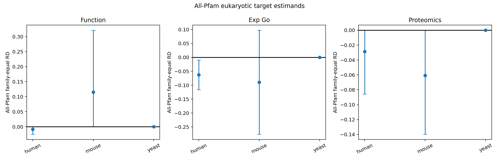

# SP-004 Round 4: Eukaryotic Common-Support Expansion
## All-Pfam, MMseqs2 grids, and orthogonal proteomics detection

**Date:** 21 September 2026  
**Status:** **NON-ESTIMABLE/MIXED - LOCKED GATE FAILED**

## Answer
Round 4 successfully added every Pfam assignment, six pinned MMseqs2 cluster definitions per domain, and a third evidence source based on live UniProt links to PeptideAtlas, ProteomicsDB, MassIVE and PRIDE. None created the prespecified eukaryotic support needed for a confirmatory within-family comparison. Human all-Pfam had five eligible families and 54 unique proteins per arm; mouse four families and 38/41 proteins; yeast two and 14/14. The gate required >=10 families and >=200 unique proteins per arm. No MMseqs2 grid produced ten clusters with >=5 proteins in both arms. The correct result is non-estimability, not no deficit.

## Locked design
The protocol was hashed before reparsing all Pfams, running clusters or retrieving proteomics cross-references. UniProt reviewed human, mouse and yeast proteins 20-200 aa came from the checksum-frozen R2 exports. Six MMseqs2 definitions crossed 30%, 50%, 70% identity with 50% and 80% coverage of the shorter sequence. Eligible clusters required five proteins per arm. All-Pfam estimates required the same per-family support; proteins in multiple families were retained with a planned accession-equalized sensitivity.

The orthogonal endpoint `any_proteomics` was a union of live PeptideAtlas, ProteomicsDB, MassIVE and PRIDE links. It measures database-linked detection opportunity, not direct peptide-level validation in this package.

## Estimability results
### All-Pfam
| Domain | Eligible families | Unique short | Unique control | Estimable? |
|---|---:|---:|---:|---|
| Human | 5 | 54 | 54 | No |
| Mouse | 4 | 38 | 41 | No |
| Yeast | 2 | 14 | 14 | No |

Adding all Pfams barely expanded R3 because length-spanning, reviewed eukaryotic Pfam families with five proteins per arm are genuinely uncommon. Largest-arm family shares were 40.7%, 44.7% and 57.1%; yeast additionally violated the locked <=50% dominance rule.

### MMseqs2
Human had 16-72 mixed clusters depending on grid, but only 1-3 clusters with >=5 members per arm. Mouse had 3-44 mixed clusters and zero eligible clusters. Yeast had 11-16 mixed clusters and at most one eligible cluster. Thus more permissive identity did create pairs and small mixed groups, but not enough replicated within-cluster sampling for the locked target estimand.

This distinction matters: "mixed cluster exists" is not the same as an estimable family contrast. Relaxing to singleton/pair comparisons after seeing these counts would produce unstable, family-idiosyncratic answers and violate the protocol.

## Descriptive evidence patterns
Proteomics links were common in the full reviewed cohorts: human 88.1% short versus 94.5% controls; mouse 74.2% versus 82.2%; yeast 71.9% versus 88.1%. These are broad descriptive deficits, but the within-all-Pfam values come from only 2-5 families. Human's family-equal proteomics difference was -2.86 points, mouse -6.09, yeast 0. Human experimental GO was -6.27 points inside five families; its bootstrap interval excluded zero, but this cannot override the minimum-family and unique-protein gates.

MMseq outputs are retained even when no eligible effect table exists. Cluster diagnostics document total, mixed and eligible cluster counts for every grid.

## Cross-round synthesis
R3 resolved the bacterial mechanism because bacterial reviewed data offered 82 length-spanning Pfam families. R4 shows that the same design cannot currently resolve reviewed eukaryotes: the problem is not only choosing first versus all Pfams, and not only sequence-identity threshold. It is the absence of sufficiently large reviewed, length-spanning eukaryotic families within 20-200 aa.

The new proteomics source strengthens the next hypothesis: short reviewed eukaryotic proteins have fewer linked detections in broad cohorts. But family-conditioned confirmation needs a different sampling frame, likely unreviewed proteins, ortholog groups spanning taxa, or peptide-level projects with shared acquisition protocols.

## Gate
All-Pfam was non-estimable in all three domains. Zero MMseqs definitions were estimable. The protocol required all-Pfam support in two domains plus direction agreement in two estimable MMseqs grids per successful domain. Success is impossible under the observed support, so status is non-estimable/mixed.

## Tool provenance
MMseqs2 binary version was `d401e78c2d18a822cdb1527d7464a043f6035a15`; download hash and exact grids are preserved. Every cluster assignment TSV is included. Proteomics queries, UTC retrieval times and raw TSV hashes are included. No synthetic data or hand-built replacement clustering was used.

## Limits
UniProt cross-references do not prove comparable mass-spectrometry protocols. Reviewed proteins are selected. All-Pfam duplicates proteins across families. MMseqs clustering of short sequences is sensitive to thresholds and cannot establish homology alone at low identity. The first successful-looking small stratum was not promoted to a result. No domains were pooled.

## Next decisive design
Move to a third-source-native sampling frame: PRIDE/ProteomeXchange projects with shared sample preparation and acquisition, then compare detected short/control proteins within project and ortholog group. Alternatively, include unreviewed eukaryotic UniProt entries to expand family support while treating reviewed status and proteomics detection as separate outcomes. The protocol must predefine peptide FDR, proteotypic peptide opportunity and project-level clustering.
