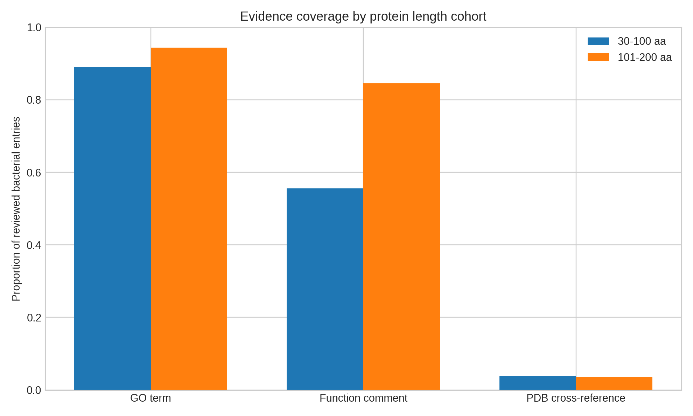
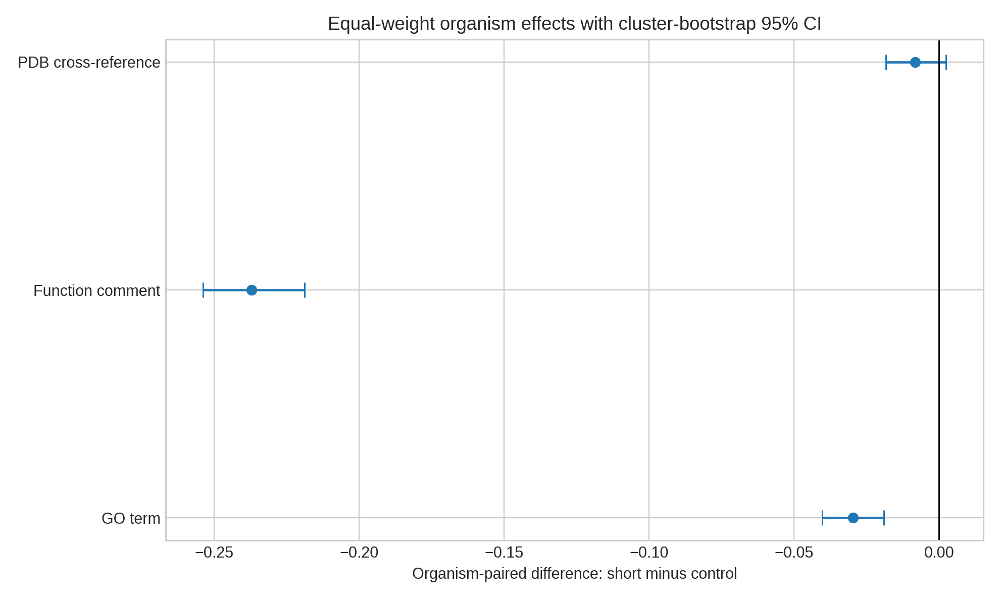

# SP-004: The Small Protein Evidence Gap
## A protocol-first cross-resource experiment on reviewed bacterial proteins

**Experiment date:** 21 September 2026  
**Inventory topic:** DOC-2-077, "The Small Protein Problem"  
**Status:** MIXED EVIDENCE - LOCKED GATE FAILED

## Executive result
A live UniProtKB experiment compared 30,573 reviewed bacterial proteins 30-100 amino acids long with 80,401 reviewed bacterial proteins 101-200 amino acids long. Small proteins had 5.32 percentage points less GO coverage and 28.89 points less explicit function-comment coverage. Equal-weight comparison within 1,191 organisms confirmed both gaps: -2.96 points (95% organism-bootstrap CI -4.02 to -1.91) for GO and -23.71 points (-25.39 to -21.88) for function comments. However, the locked three-endpoint gate failed. UniProt PDB-link coverage was slightly *higher* at entry level in the short cohort (3.79% vs 3.51%, +0.27 points), although the exact-organism estimate was slightly lower and uncertain (-0.82 points, 95% CI -1.84 to +0.24). The experiment therefore supports an annotation-text gap but not a universal evidence deficit.

## Why this matters
Small proteins can be missed by gene calling, homology pipelines, and proteomics. A useful audit must separate those discovery problems from the evidence attached to proteins already admitted to a curated database. This experiment intentionally uses reviewed UniProtKB records, a stringent and biased slice of known proteins, then asks whether evidence gaps remain. It is not a count of the unknown small proteome.

## Protocol integrity
`protocol/LOCKED_PROTOCOL.md`, `protocol/protocol.json`, and `LOCKED_PROTOCOL.sha256` were written and hashed at 20:31 IST before cohort retrieval or outcome calculation. The gate required all three primary directions to be negative, at least two cluster-bootstrap intervals below zero, robustness in exact-organism and non-ribosomal analyses, stable leave-one-phylum-out behavior, >=95% UniProt/RCSB concordance, and integrity checks. The PDB direction violated the first condition; no gate was relaxed afterward.

## Data and cohort
The live UniProtKB REST stream was queried for `reviewed:true AND taxonomy_id:2` in two fixed length ranges. Retrieval URLs, UTC times, response headers, raw TSVs, and SHA-256 hashes are preserved. Required core fields and range checks excluded no records, but one accession present in both length queries was treated as a duplicate by the cross-cohort integrity rule, leaving 110,974 unique entries. The unit of description is the accession. Confirmatory uncertainty uses organism-level pairing to avoid treating many proteins from the same organism as independent biological replicates.

Major cohort composition was similar but not identical. Pseudomonadota accounted for 15,560 short and 44,048 control entries; Bacillota for 7,071 and 16,452. All major-phylum leave-one-out estimates preserved the GO and function-comment directions.

## Frozen primary endpoints and results
| Endpoint | 30-100 aa | 101-200 aa | Entry risk difference | Equal-weight organism difference | 95% organism-bootstrap CI | Gate direction |
|---|---:|---:|---:|---:|---:|---|
| GO term | 27,225/30,573 (89.05%) | 75,871/80,401 (94.37%) | -5.32 pp | -2.96 pp | -4.02 to -1.91 pp | Met |
| Function comment | 16,998/30,573 (55.60%) | 67,929/80,401 (84.49%) | -28.89 pp | -23.71 pp | -25.39 to -21.88 pp | Met |
| PDB cross-reference | 1,158/30,573 (3.79%) | 2,825/80,401 (3.51%) | +0.27 pp | -0.82 pp | -1.84 to +0.24 pp | Failed at entry level |

The one-sided entry-level Fisher tests for GO and function comments remained significant after Benjamini-Hochberg correction; these p-values are descriptive because entry independence is untenable. Organism-paired estimates are the confirmatory results.

## Secondary endpoints
EC coverage showed the largest additional deficit: 8.05% in the short cohort versus 33.11% in controls (-25.05 points). Signal-peptide annotation was 1.01% versus 2.16% (-1.15 points), and transmembrane annotation was 9.39% versus 9.50% (-0.11 points). These endpoints were prespecified as secondary and cannot rescue or redefine the failed primary gate.

## Robustness and falsification
### Ribosomal-family composition
Ribosomal proteins were common and almost universally carried GO terms. After excluding every name containing "ribosomal," the GO gap widened to -12.26 points and the function-comment gap remained -14.53 points. PDB coverage still ran slightly higher in short proteins (+0.63 points), so ribosomal composition does not explain the contradictory PDB result.

### Uncertain names
After excluding names containing hypothetical, uncharacterized, or putative, the GO gap was -3.71 points and function-comment gap -29.39 points. PDB remained +0.42 points at entry level. Records with uncertain names behaved as a negative-space control: only 62.85% had GO and 32.30% had function comments, versus 94.72% and 79.21% among named records.

### High annotation-score restriction
Among entries with annotation score >=4, all three directions were negative: GO -1.06 points, function comments -1.52, and PDB -1.60. This is informative but does not override the frozen primary cohort; conditioning on annotation score selects directly on the evidence being studied.

### Length bands
The shortest 30-60 aa group had only 22.67% function-comment coverage but 4.73% PDB coverage. The 61-100 aa group had 63.01% and 3.57%, respectively. The pattern suggests that famous, structurally characterized microproteins coexist with a broad function-comment deficit, making "evidence" multidimensional rather than a single gradient.

### Taxonomic sensitivity
Across major-phylum exclusions, the GO risk difference ranged from -5.57 to -4.10 points and function-comment difference from -29.69 to -28.05. PDB remained positive at entry level (+0.11 to +0.56). No leave-one-major-phylum-out result reversed by more than the locked +2 point tolerance.

### Cross-resource validation
An accession-hash-ranked sample of 80 records was frozen: 20 UniProt PDB-positive and 20 PDB-negative accessions in each cohort. Live RCSB Search API responses agreed with UniProt PDB-link presence in 80/80 cases. Raw JSON is retained. This validates the parser and linkage field, not the completeness of structural biology.

## Gate decision
- All three primary entry-level directions negative: **FAIL**.
- At least two organism-bootstrap CIs below zero: **PASS**.
- At least two endpoints negative in exact-organism and non-ribosomal analyses: **PASS**.
- No major-phylum exclusion reversal over +2 points: **PASS**.
- RCSB concordance >=95%: **PASS** (100%).
- Integrity checks: **PASS**.

Final status: **mixed evidence, gate failed**. The negative result is not a defect. It prevents an inflated claim that short proteins lack every kind of evidence.

## Biological interpretation
The strongest defensible finding is narrower: even among reviewed bacterial entries, short proteins receive less broad functional annotation, especially explicit function comments. Structural evidence does not obey the same simple relationship. Selection into reviewed UniProtKB likely enriches the short cohort for historically important, tractable, or highly studied microproteins. Ribosomal proteins and other compact structural targets can accumulate many PDB links, while many non-famous short proteins retain thin functional descriptions. PDB cross-references also measure deposition linkage, not standalone structure quality or functional understanding.

The literature supports caution. Reviews describe size-dependent gene-prediction and proteomics challenges, but the present data cannot quantify proteins never discovered or never admitted to UniProtKB. Empty annotation fields are database evidence states, not proof of absent biological knowledge.

## Reusable decision product
A research-grade **Small Protein Evidence Triage** export can rank reviewed entries for curator or experimental follow-up using transparent missingness, taxonomy, annotation score, protein-existence evidence, and family context. The included `product/TRIAGE_SPECIFICATION.md` defines its scope and safeguards. It must never assign function or label an entry "unknown" solely from missing fields.

A credible prospective test would give curators a frozen ranked list and a random-list control, then measure actionable updates per hour, redundant-review rate, false-priority rate, and subgroup equity across taxa. Until that trial, this package is an audit method, not production software.

## Rights, safety, and governance
Only public database records are used; no personal or clinical data are present. Attribution, access date, query, and checksums are preserved. Database terms and citation guidance should be reviewed before redistribution outside research. Misuse risks include equating missing fields with biological absence, over-prioritizing well-studied taxa, and treating PDB linkage as structure quality. Human curator review is mandatory. Monitoring should flag API schema changes, cohort drift, and taxonomic skew; rollback is reversion to the last checksum-verified export.

## Limitations
This is cross-sectional and observational. Sequence length is entangled with family, cellular role, publication history, and database selection. Reviewed records are not representative of bacterial proteomes. Organism pairing controls taxon identity only coarsely. Protein-name string filters are transparent but imperfect. PDB linkage is binary and ignores resolution, method, chain coverage, and whether the small protein is merely a complex component. GO presence ignores evidence code and ontology depth. The study does not inspect unreviewed entries, genomic small ORFs, expression, or direct experimental function.

## Follow-up experiments
1. Repeat unchanged endpoints in unreviewed UniProtKB, reported separately, to test selection effects.
2. Use NCBI RefSeq genomes to measure length-dependent gene-model absence without assuming UniProt inclusion.
3. Grade GO evidence codes and ontology depth rather than presence alone.
4. Grade RCSB structures by experimental method, chain coverage, and standalone versus complex context.
5. Conduct the prospective curator-time trial before any commercial claim.

## Reproducibility map
- Locked design: `protocol/`
- Original API outputs: `data/raw/`
- Analysis-ready table and exclusions: `data/processed/`
- Executable analysis: `code/run_analysis.py`
- Numeric outputs and controls: `results/`
- Publication figures: `figures/`
- Query URLs, headers, dates, source ledger, and hashes: `provenance/`
- Translation specification: `product/`
- Independent quality decision: `review/FLAGSHIP_REVIEW.md`
