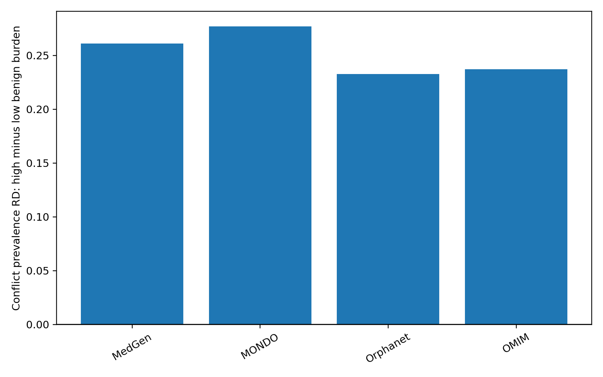

# DOC-2-096 R0: Disease Networks from Bounded Negative Evidence

**Date:** 21 September 2026  
**Status:** LOCKED-GATE SUCCESS

## Result
A live ClinVar GRCh38 audit produced 581,228 stable-ID gene-condition edges spanning 21,608 genes and 31,819 conditions. 49,863 edges had at least two pathogenic/likely-pathogenic variants. Across all edges, 55,054 carried contradictory evidence; 40,683 positive edges were contradiction-bearing.

The core finding passed every locked criterion. Within positive edges, high benign burden was associated with a 25.2 percentage-point higher prevalence of conflicting-class variants after exact stratification by identifier source, gene degree, condition degree and high-review status. Direction replicated in four identifier-source strata. Reliability weighting changed 35.8% of top-decile disease neighbors while preserving 80.4% of neighbors built from high-review edges. An accession-initial negative-control dispersion (18.5 points) was smaller than the stratified instability effect.

## Interpretation
Benign evidence is useful in a disease network when represented as bounded context, not as absence of gene-disease association. Edges with both pathogenic and benign variants often indicate allelic heterogeneity, phenotype granularity, variant-mechanism specificity or curation disagreement. Downweighting these edges materially changes disease similarity, but high-review neighborhoods are largely retained.

## Locked design
The protocol preceded downloads and fixed stable identifiers, GRCh38, positive threshold P>=2, contradiction definitions, degree/review/source strata, projection weighting and success gates. A benign variant never deleted a positive gene-condition edge. Reliability was P/(P+B+conflicting+1), used only to weight shared-gene disease projections.

## Network scale
- 581,228 gene-condition edges
- 49,863 positive edges
- 55,054 contradiction-bearing edges overall
- 368,470 disease-disease projection pairs
- High benign-burden threshold: 0.557 among P+B evidence

## Gate
All passed: minimum edge and contradiction counts, positive adjusted instability association, replication across >=2 ID sources, >=5% top-neighbor change, >=80% high-review preservation, and a smaller negative-control effect.

## Restraint and limitations
This is an evidence-topology experiment, not a clinical classifier. Aggregate ClinVar labels compress submitter histories. Condition identifiers can be duplicated across MedGen, OMIM, Orphanet and MONDO, so source strata are not independent diseases. Counts do not model allele frequency, molecular consequence, inheritance or submitter dependence. The submission-summary file is retained for the next round but was not misrepresented as independently linked condition assertions here. Conflicting evidence can reflect healthy scientific revision, not poor quality.

## Next round
Reconstruct submission-level assertion trajectories, normalize diseases across identifier systems, add molecular consequence/inheritance, and test whether contradiction burden predicts future classification movement under a time-frozen design. Validate against ClinGen expert-curated gene-disease validity.

## Reproducibility
The package includes protocol hashes, executable chunked analysis, processed edges, result tables, figure, URLs, retrieval metadata and raw hashes. Raw ClinVar files are omitted from the transfer archive because they total 794 MB; exact live URLs and checksums permit byte verification.
